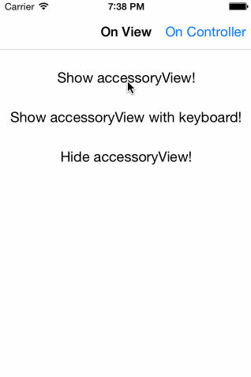

# CHGInputAccessoryView

[](http://cocoapods.org/pods/CHGInputAccessoryView)
[](http://cocoapods.org/pods/CHGInputAccessoryView)
[](http://cocoapods.org/pods/CHGInputAccessoryView)

## Usage



To run the example project, clone the repo, and run `pod install` from the Example directory first.

## Installation

CHGInputAccessoryView is available through [CocoaPods](http://cocoapods.org). To install
it, simply add the following line to your Podfile:

```ruby
pod "CHGInputAccessoryView"
```

## Usage

### Prepare a UIView or UIViewController

At first you must prepare a UIView or a UIViewController to become a first responder and to attach an input accessory view.

Make UIView/UIViewController property inputAccessoryView writeable:

```objc
@property (nonatomic, readwrite, retain) UIView *inputAccessoryView;
```

Make sure your UIView/UIViewController can become first responder:
```objc
- (BOOL)canBecomeFirstResponder
{
return YES;
}
```

### Set up a CHGInputAccessoryView

Setting up an new CHGInputAccessoryView is as simple as setting up a UIToolbar.

```objc
// get an instance of CHGInputAccessoryView
CHGInputAccessoryView *accessoryView = [CHGInputAccessoryView inputAccessoryView];

// optionaly define a delegate
accessoryView.inputAccessoryViewDelegate = self;

// create a CHGInputAccessoryViewItem
CHGInputAccessoryViewItem *trashItem = [CHGInputAccessoryViewItem buttonWithTitle:@"Trash"];

// attach accessory views items
accessoryView.items = @[ trashItem ];

// attach the accessory
self.inputAccessoryView = accessoryView;
```

### Items

CHGInputAccessoryView has some prebuild items:

- a button with title
```objc
[CHGInputAccessoryViewItem buttonWithTitle:@"my title"];
```

- a button with imgage
```objc
[CHGInputAccessoryViewItem buttonWithImage:[UIImage imageNamed:@"my_image"]];
```

- a separator
```objc
[CHGInputAccessoryViewItem separatorWithColor:[UIColor lightGrayColor] height:20.f]
```
#### Enable/Disable items

```objc
// enable item
[accessoryView enableItem:item];

// disable item
[accessoryView disableItemAtIndex:1];
```

- a UITextField
```objc
CHGInputAccessoryViewItemTextField *item = [CHGInputAccessoryViewItemTextField item];
item.textField.placeholder = @"Enter your text";
```
Tip: Modify the textField by accessing CHGInputAccessoryViewItemTextField property textField. The textField will automatically resize to the maximum availabe space. If you want a fixed size for your textField assign a frame on it and set the CHGInputAccessoryViewItem property flexibleSize to NO.

- a flexible or fixed space
```objc
[CHGInputAccessoryViewItemTextField flexibleSpace];
[CHGInputAccessoryViewItemTextField fixedSpace:25.f];
```

### Actions

- InputAccssoryViewDelegate

To use the build in delegates (didTapItem: and didTapItemAtIndex:) assign a CHGInputAccessoryViewDelegate.

```objc
accessoryView.inputAccessoryViewDelegate = self;
```

- Assign target and action
```objc
item.target = self;
item.action = @selector(didTapMyItem:);
```
By setting the target the build in delegates will not be called for this item.

- Assign action block
```objc
item.actionOnTap = ^(CHGInputAccessoryViewItem *item){
    NSLog(@"Tapped my item...");
};
```

### Add and remove items

```objc

- (void)setItems:(NSArray<CHGInputAccessoryViewItem *> *)items;
- (void)setItems:(NSArray<CHGInputAccessoryViewItem *> *)items animated:(BOOL)animated;

- (void)addItem:(CHGInputAccessoryViewItem *)item animated:(BOOL)animated;
- (void)addItem:(CHGInputAccessoryViewItem *)item atIndex:(NSUInteger)index animated:(BOOL)animated;

- (void)removeItem:(CHGInputAccessoryViewItem *)item animated:(BOOL)animated;;
- (void)removeItemAtIndex:(NSUInteger)index animated:(BOOL)animated;
```

## Author

Christian Greth, greth.christian@googlemail.com

## License

CHGInputAccessoryView is available under the MIT license. See the LICENSE file for more info.
